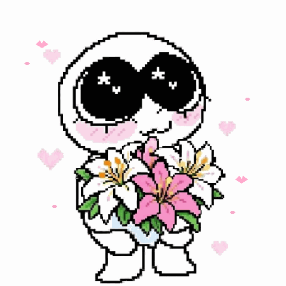
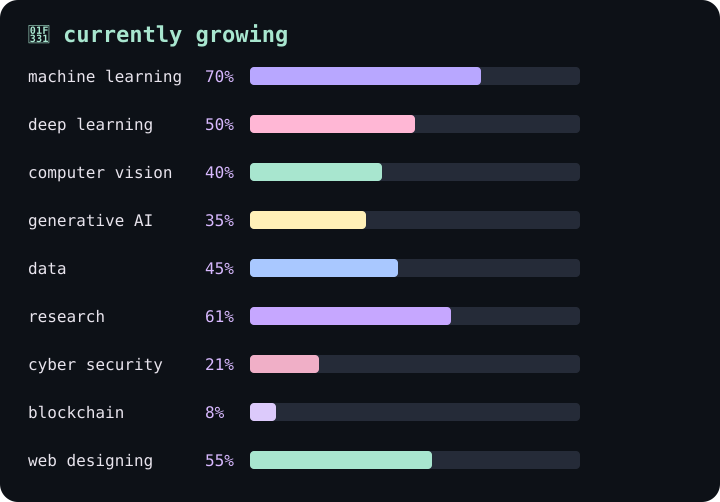
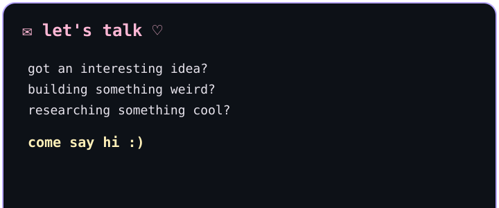

# 🌷 tejal.exe

**second-year computer science student exploring AI, data & design.**

---

<table>
<tr>
<td width="40%" align="center" valign="middle">

</td>
<td width="60%" valign="middle">

### hello, i'm tejal ♡

**second-year computer science student exploring AI, data & design.**  
Still figuring things out, overthinking my options, and occasionally spiraling into *way too many* thoughts about what I'm supposed to be doing with my life.

Still, I keep showing up. Even when a new AI model drops every other night and gives me a tiny existential crisis about my career 🫠

Currently curious about almost everything, always learning, building practical things, and very open to collaborations, new ideas, and seeing where all of this takes me. 🌷♡

</td>
</tr>
</table>

---

## 🌱 currently growing

> *progress, not perfection. ♡*

---

## 📊 github at a glance

---

## 💌 let's talk ♡

[**github · @teeezal**](https://github.com/teeezal) · [**linkedin · /tejalnarwal**](https://www.linkedin.com/in/tejalnarwal/)

*i'm anonymous elsewheree 🤧*

---

🐈 🌸 ✦ **keep learning, keep building, keep being curious.** ✦ 🌸 🐈

made with curiosity, too many tabs, and probably a cat nearby.

